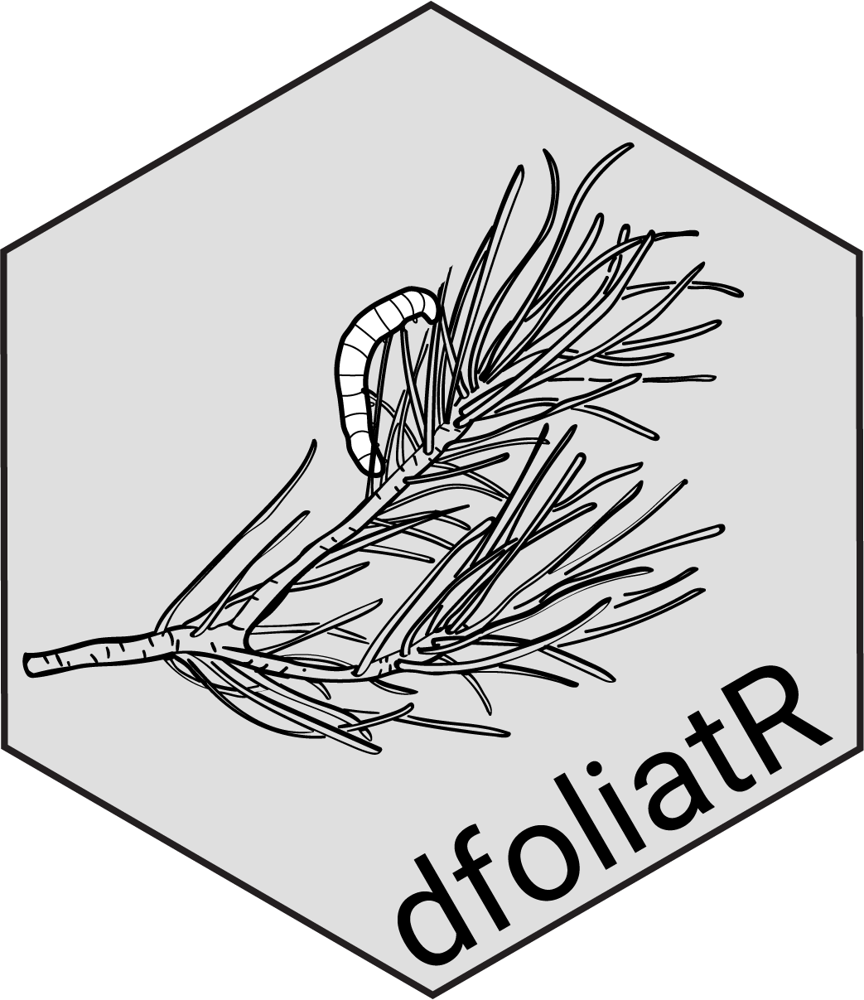
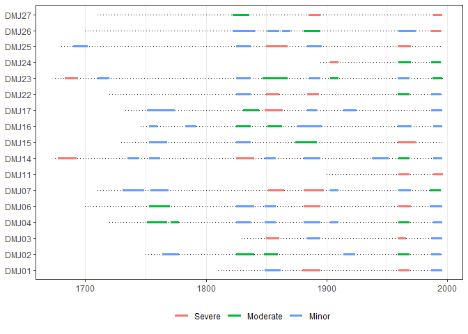
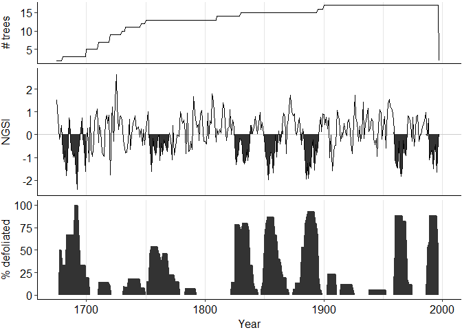

<!-- README.md is generated from README.Rmd. Please edit that file -->

# dfoliatR 

<!-- badges: start -->

[](https://travis-ci.org/chguiterman/dfoliatR)
[](https://coveralls.io/github/chguiterman/dfoliatR?branch=master)
[](https://zenodo.org/badge/latestdoi/104808563)

<!-- badges: end -->

The goal of `dfoliatR` is to provide dendrochronologists with tools for
identifying and analyzing the signatures of insect defoliators preserved
in tree rings. The methods it employs closely follow (or in some cases
exactly replicate) OUTBREAK, a FORTRAN program available from the
[Dendrochronological Program
Library](https://www.ltrr.arizona.edu/pub/dpl/).

## Installation

You can install the released version of dfoliatR from
[CRAN](https://CRAN.R-project.org) with:

``` r
install.packages("dfoliatR")
```

And the development version from [GitHub](https://github.com/) with:

``` r
# install.packages("devtools")
devtools::install_github("chguiterman/dfoliatR")
```

## Usage

The package requires users to input two sets of tree-ring data:
standardized ring widths of individual host trees and a standardized
tree-ring chronology from a local non-host tree species. `dfoliatR`
combines these to remove the climate signal represented by the non-host
chronology from the host tree series. What’s left should represent a
disturbance signal. Then `dfoliatR` identifies defoliation events in the
host tree series.

We recommend that the input tree-ring data be standardized in either
ARSTAN or the `dplR` R package. These standardized ring-width series
should be averaged to the tree level. In ARSTAN, make sure to output
‘.TRE’ files and read them into R with the `read.compact()` function
in `dplR`. If you choose to standardize raw ring widths in `dplR` with
`detrend()`, then use the `treeMean()` function to generate tree-level
series. All data input to `dfoliatR` needs to be an `rwl` object as
defined in `dplR`.

## Example

Here we briefly explore defoliation and outbreaks patterns for a
Douglas-fir site in New Mexico. These data re includedin the package

``` r
library(dfoliatR)
## load the data
data("dmj_h")
data("dmj_nh")
```

To start out, we identify *defoliation* events on individual trees,

``` r
## Identify defoliation signals
dmj_defol <- defoliate_trees(host_tree = dmj_h, nonhost_chron = dmj_nh)

## Plot the results
plot_defol(dmj_defol)
```



And then scale up to *outbreaks* by compositing across the site via

``` r
## Identify site-level outbreak patterns
dmj_obr <- outbreak(dmj_defol)

## Plot those results
plot_outbreak(dmj_obr)
```



## Further resources

Analyses of the tree series (termed `defol` objects) can be done via:

  - `plot_defol()`
  - `defol_stats()`
  - `get_defol_events()`
  - `sample_depth()`

To identify ecologically-significant outbreak events, use the
`outbreak()` function. Various filters are available to aid users in
defining outbreak thresholds. Analyses of outbreak series (termed `obr`
objects) can be done via:

  - `plot_outbreak()`
  - `outbreak_stats()`

For the full range of usage in `dfoliatR`, please visit the
[introduction
vignette](https://chguiterman.github.io/dfoliatR/articles/intro-to-dfoliatR.html).

#### Questions, concerns, problems, ideas, or want to contribute?

Please contact the author, Chris Guiterman
